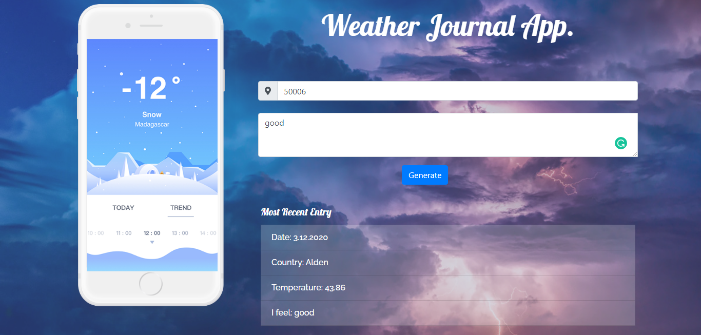
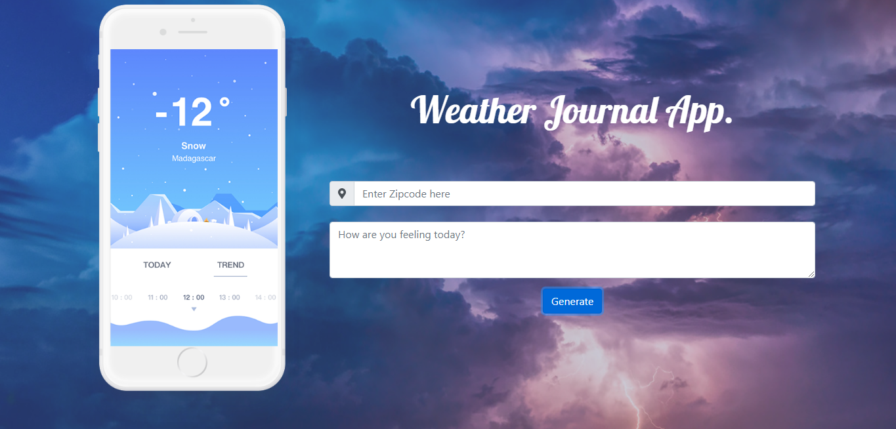

# Weather-Journal App Project 
Udacity Front-End Web Developer Nano-degree - Web APIs and Asynchronous Applications (Project-3): Weather-Journal App Project.

## To start
-Run the command 'npm install' to install required dependencies (npm install express, npm install body-parser).

-The project can be run by running the command "node server.js" in the root directory and then opening http://localhost:8000/ in browser.

