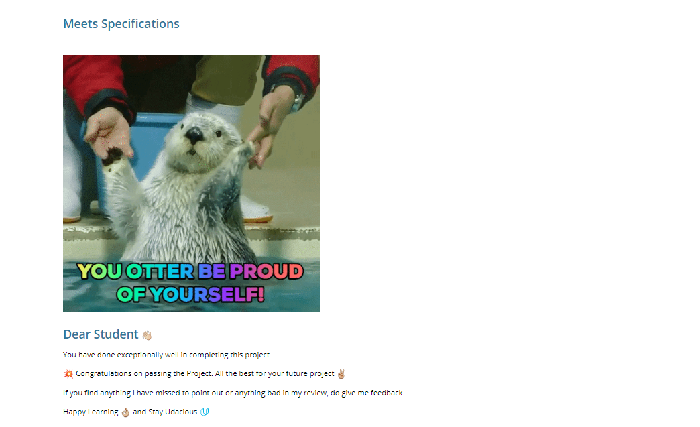

# Personal Blog Website

This project requires you to utilize your HTML and CSS skills to build out a personal blog website, including custom images, layout, and styling.
Along with webpage design considerations, you'll work to appropriately structure your files, as well as use proper CSS and HTML formatting & style.

## Live Url:-
https://shroouk.github.io/Udacity-FrontEnd-Web-Developer-NanoDegree-Program/personal-blog-web/

